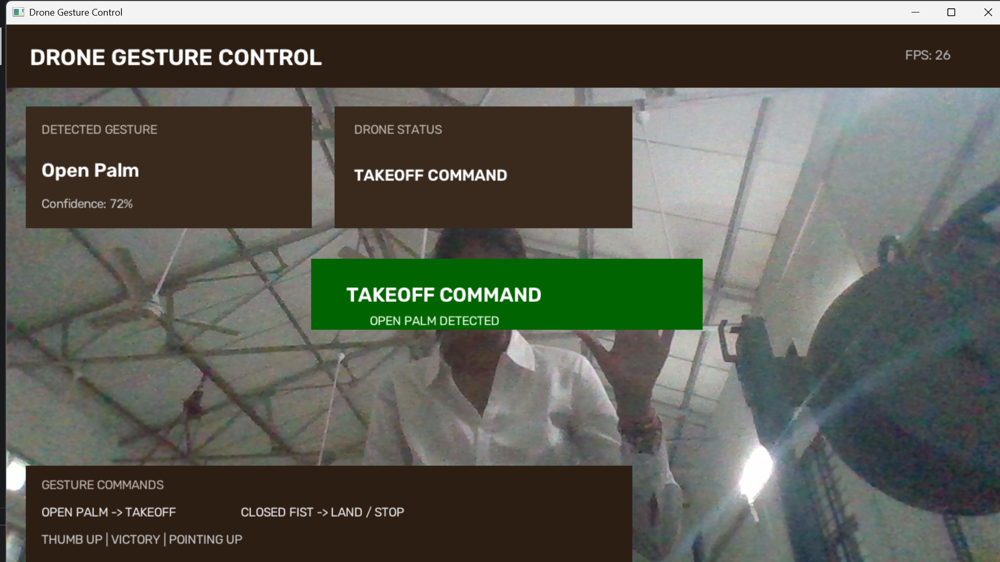
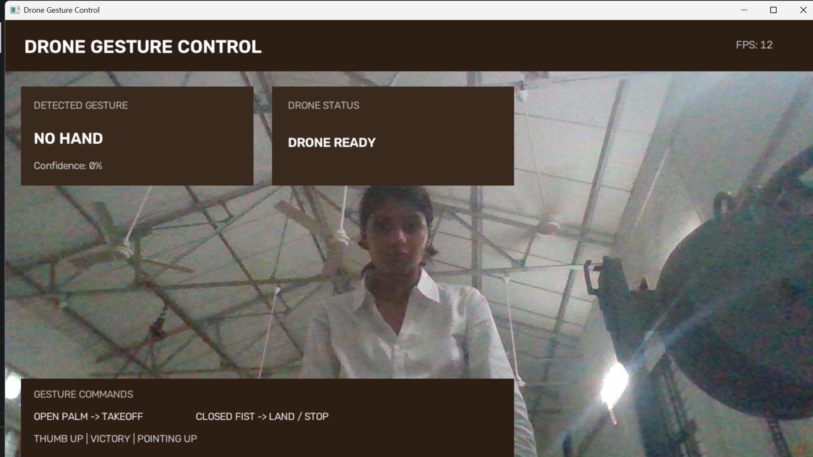

# ✋ Drone Hand Gesture Teleoperation & Real-Time UI

This module provides a **touchless, vision-based teleoperation interface** for UAVs (drones), powered by **Google MediaPipe Tasks Vision** and an interactive **OpenCV Head-Up Display (HUD)**.

---

## 🌟 Key Features

- **Google MediaPipe Gesture Recognition**: Uses the state-of-the-art `gesture_recognizer.task` bundle to recognize hand landmarks and gesture categories at high frame rates.
- **Custom OpenCV HUD Interface**:
  - 🖥️ **Header Bar**: Live FPS counter and system title.
  - 📊 **Detected Gesture Card**: Real-time gesture classification and confidence percentage.
  - 🚁 **Drone Status Card**: System state indicator (e.g., `DRONE READY`, `HOLD PALM 0.7s`, `TAKEOFF COMMAND`).
  - 📋 **Command Legend Card**: Quick reference guide at the bottom of the feed for intuitive operation.
  - 🟢 **Takeoff Banner**: Prominent green center alert displayed upon confirming takeoff.
- **Safety Hold Logic**: Prevents accidental drone launches by requiring the pilot to maintain an `Open_Palm` gesture continuously for **1.0 second** before emitting a takeoff trigger.
- **Automatic Model Resolution & Download**: Seamlessly detects and caches `gesture_recognizer.task` locally or downloads it automatically from Google Cloud Storage on first run.

---

## 🎮 Gesture Control Protocol

| Gesture | Action | Flight Command | Safety Logic |
| :--- | :---: | :--- | :--- |
| **`Open_Palm`** | ✋ | **TAKEOFF** | Requires continuous **1.0s hold**. Real-time countdown displayed on HUD. |
| **`Closed_Fist`** | ✊ | **LAND / STOP** | **Immediate** trigger. Cuts horizontal velocity and lands drone safely. |
| **`Thumb_Up`** | 👍 | **CONFIRM** | Confirms mission waypoint or flight mode authorization. |
| **`Victory`** | ✌️ | **MODE SWITCH** | Toggles between Manual Gesture Mode and Autonomous Waypoint Mode. |
| **`Pointing_Up`**| ☝️ | **ASCENT** | Commands drone to increase altitude by fixed increment. |
| **`No Hand`** | 🚫 | **HOVER / READY** | Hand not in frame: drone stays in safe station-keeping hover. |

---

## 🏗️ Technical Architecture & Pipeline

```
┌─────────────────────────────────┐
│  Webcam Feed / Video Stream     │
└────────────────┬────────────────┘
                 │
                 ▼
┌─────────────────────────────────┐
│  Frame Mirror & BGR->RGB Convert│
└────────────────┬────────────────┘
                 │
                 ▼
┌─────────────────────────────────┐
│  MediaPipe Gesture Recognizer   │
│  (Landmark Track & Classify)    │
└────────────────┬────────────────┘
                 │
                 ▼
┌─────────────────────────────────┐
│  Safety Gate: 1.0s Palm Hold?   │
│  - Hold >= 1.0s -> TAKEOFF      │
│  - Hold <  1.0s -> COUNTDOWN    │
│  - Other Gesture -> RESET TIMER │
└────────────────┬────────────────┘
                 │
                 ▼
┌─────────────────────────────────┐
│  Render OpenCV Head-Up Display  │
│  (FPS + Cards + Status Banner)  │
└─────────────────────────────────┘
```

---

## 📸 Teleoperation HUD Interface

<div align="center">

| **Takeoff Trigger (1.0s Palm Hold)** | **Drone Ready / Standby Mode** |
| :---: | :---: |
|  |  |
| *Takeoff command activated after 1-second hold* | *Live HUD displaying FPS, gesture, and drone telemetry* |

</div>

---

## 📋 Configuration Parameters

The following parameters in [`Gesture_MediaPipe_test_1.py`](Gesture_MediaPipe_test_1.py) can be fine-tuned:

```python
CAMERA_INDEX = 0             # 0 for default internal webcam, 1 or 2 for external USB camera
CONFIDENCE_THRESHOLD = 0.40  # Minimum confidence required to evaluate commands (0.0 to 1.0)
PALM_HOLD_TIME = 1.0         # Seconds required to maintain Open Palm before takeoff triggers
```

MediaPipe options:
```python
options = vision.GestureRecognizerOptions(
    base_options=base_options,
    running_mode=vision.RunningMode.VIDEO,
    num_hands=1,                          # Number of hands to track simultaneously
    min_hand_detection_confidence=0.5,
    min_hand_presence_confidence=0.5,
    min_tracking_confidence=0.5
)
```

---

## 🚀 How to Run

### 1. From the Repository Root
```bash
python DRONE/GESTURE/Gesture_MediaPipe_test_1.py
```

### 2. From the Gesture Directory
```bash
cd DRONE/GESTURE
python Gesture_MediaPipe_test_1.py
```

### 3. Controls
- Present your hand in front of the camera.
- Hold an open palm for 1 second to observe the takeoff countdown and trigger.
- Press <kbd>Q</kbd> in the active window to stop the camera feed and exit.

---

## 🔮 Future Enhancements

1. **Two-Hand Dual-Stick Flight Control**:
   - **Left Hand**: Vertical axis (Throttle / Altitude) and Yaw (Rotation).
   - **Right Hand**: Pitch (Forward / Backward) and Roll (Left / Right) vectoring.
2. **Temporal Landmark Filtering (Kalman / EMA)**:
   - Filter frame-to-frame landmark jitter for ultra-smooth control signals.
3. **MAVLink / PX4 / ROS2 Integration**:
   - Transmit real-time Mavlink `SET_POSITION_TARGET_LOCAL_NED` or `COMMAND_LONG` packets over telemetry radio to a physical quadcopter.
4. **Dynamic Gesture Trajectories**:
   - Recognize motion patterns (e.g., circular hand sweep to trigger 360° drone panorama).

