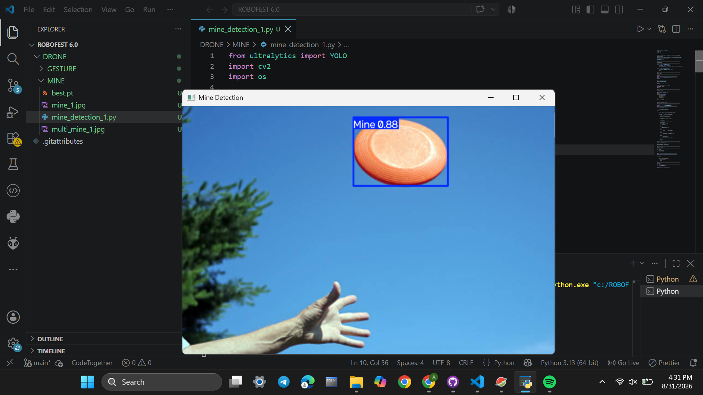
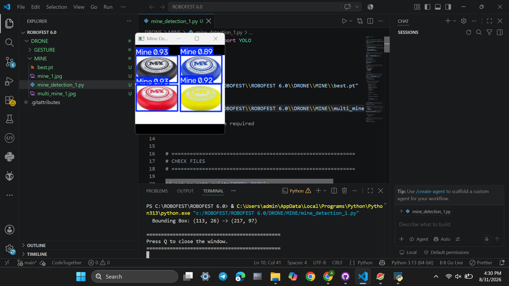

# 🎯 Custom YOLO Multi-Landmine Aerial Detection

This module implements an **automated vision-based landmine detection system** for aerial UAV surveillance, powered by a customized **YOLO** deep learning model (`best.pt`).

---

## 🌟 Key Features

- **Multi-Object Detection**: Capable of localizing and classifying **multiple landmines simultaneously** in dense or dispersed minefields.
- **Custom-Trained Weights (`best.pt`)**: Fine-tuned specifically for recognizing landmine surface signatures, casings, and pressure plates against varied terrain.
- **Bounding Box & Confidence Telemetry**: Computes pixel-precise bounding coordinates $(x_1, y_1, x_2, y_2)$ and prediction probabilities for every detected hazard.
- **Visual & Terminal Output**: Generates annotated visual overlays while logging structured detection reports to the terminal.

---

## 🏗️ Detection Pipeline Architecture

```
┌─────────────────────────────────┐
│  Aerial Recon Image / Stream    │
└────────────────┬────────────────┘
                 │
                 ▼
┌─────────────────────────────────┐
│  Image Resizing (640x640)       │
│  & Pixel Normalization          │
└────────────────┬────────────────┘
                 │
                 ▼
┌─────────────────────────────────┐
│  YOLO Feature Backbone & FPN    │
│  (Deep Feature Extraction)      │
└────────────────┬────────────────┘
                 │
                 ▼
┌─────────────────────────────────┐
│  Multi-Mine Detection Head      │
│  (Class Score & Bounding Box)   │
└────────────────┬────────────────┘
                 │
                 ▼
┌─────────────────────────────────┐
│  Confidence Threshold Filter    │
│  & Non-Maximum Suppression(NMS) │
└────────────────┬────────────────┘
                 │
                 ▼
┌─────────────────────────────────┐
│  Annotated Visual Window &      │
│  Console Telemetry Output       │
└─────────────────────────────────┘
```

---

## 📸 Detection Visual Results

<div align="center">

| **Single Mine Detection (`mine_1.jpg`)** | **Multi-Mine Detection (`multi_mine_1.jpg`)** |
| :---: | :---: |
|  |  |
| *Single target detected with high confidence* | *Concurrent multi-target localization* |

</div>

---

## 📁 Module Assets

- **`mine_detection_1.py`**: Main Python script executing model prediction, parsing bounding boxes, and rendering annotated output.
- **`best.pt`**: Serialized PyTorch/Ultralytics model weights from custom training.
- **`mine_1.jpg`**: Single landmine evaluation image.
- **`multi_mine_1.jpg`**: Multi-landmine cluster evaluation image for validating concurrent detection.
- **`Single_Mine_Detection.png`**: Output visual showing single mine detection.
- **`Multiple_Mine_Detection.png`**: Output visual showing multiple simultaneous mine detections.

---

## 📋 Configuration Parameters

In [`mine_detection_1.py`](mine_detection_1.py), you can adjust the following parameters:

```python
# Model and Image Paths (automatically resolves relative to script location)
MODEL_PATH = "best.pt"
IMAGE_PATH = "mine_1.jpg"        # Change to "multi_mine_1.jpg" for multiple mines

# Detection sensitivity
CONFIDENCE = 0.40                 # Minimum confidence threshold (0.0 to 1.0)
```

Inference settings:
```python
results = model.predict(
    source=IMAGE_PATH,
    conf=CONFIDENCE,
    imgsz=640,                   # Image size for network inference
    verbose=False
)
```

---

## 🚀 How to Run

### 1. From the Repository Root
```bash
python DRONE/MINE/mine_detection_1.py
```

### 2. From the Mine Directory
```bash
cd DRONE/MINE
python mine_detection_1.py
```

### 3. Testing Multi-Mine Scenarios
To test multiple mine detection, change `DEFAULT_IMAGE` or edit `IMAGE_PATH` in `mine_detection_1.py`:
```python
IMAGE_PATH = os.path.join(SCRIPT_DIR, "multi_mine_1.jpg")
```
Then run the script.

### 4. Sample Terminal Output
```plaintext
==============================================
          MINE DETECTION SYSTEM
==============================================

Loading YOLO model...
Model loaded successfully.

Model classes:
{0: 'mine'}

Running detection...

==============================================
             DETECTION RESULTS
==============================================
Objects detected: 2

Detection 1:
  Class      : mine
  Confidence : 92.45%
  Bounding Box: (142, 210) -> (285, 360)

Detection 2:
  Class      : mine
  Confidence : 88.12%
  Bounding Box: (410, 180) -> (530, 310)

==============================================
Press Q to close the window.
==============================================
```

---

## 🔮 Roadmap & Accuracy Enhancement Strategies

To achieve industrial-grade reliability for autonomous demining missions, we are pursuing the following enhancements:

### 1. Dataset Expansion & Advanced Augmentations
- **Diverse Soil Profiles**: Incorporate imagery across desert sand, mud, dry grass, gravel, clay, and snow.
- **Lighting & Shadow Invariance**: Augment training data with extreme solar angles, shadows from drone propellers, and overcast diffuse lighting.
- **Partial Burial & Weathering**: Train models on artificially weathered and partially sub-surface buried landmine casings.

### 2. Video Stream Processing & Object Tracking
- **Live Drone Stream Support**: Stream real-time aerial footage via RTSP / USB Gimbal camera.
- **Multi-Object Tracking (ByteTrack / DeepSORT)**: Ensure detected mines maintain unique track IDs across consecutive aerial frames to avoid duplicate counts.

### 3. Thermal / Multispectral Infrared Fusion
- Integrate FLIR thermal sensor feeds to detect underground thermal inertia anomalies caused by buried metallic and plastic landmines.

### 4. Edge AI Acceleration (ONNX / TensorRT)
- Convert `best.pt` to **TensorRT FP16 / INT8** engine for ultra-low latency real-time inference on edge compute platforms (NVIDIA Jetson Orin Nano, Raspberry Pi 5 with AI Hat).
- Export to ONNX / OpenVINO for cross-platform hardware acceleration.

