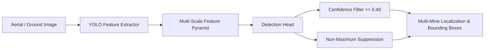

# 🛸 ROBOFEST 6.0 — Autonomous Drone Vision & Teleoperation System

[](https://www.python.org/)
[](https://opencv.org/)
[](https://github.com/ultralytics/ultralytics)
[](https://developers.google.com/mediapipe)
[]()

A comprehensive dual-module computer vision and artificial intelligence system developed for **ROBOFEST 6.0**. This project combines **real-time contactless drone gesture teleoperation** with a **customized YOLO multi-landmine aerial detection model**.

---

## 📌 Project Overview

```
                      ┌────────────────────────────────────────┐
                      │             ROBOFEST 6.0               │
                      │   Drone Vision & Control Platform      │
                      └──────────────────┬─────────────────────┘
                                         │
                 ┌───────────────────────┴───────────────────────┐
                 │                                               │
                 ▼                                               ▼
   ┌───────────────────────────┐                   ┌───────────────────────────┐
   │  ✋ GESTURE TELEOPERATION │                   │   🎯 MULTI-MINE DETECTION │
   │  • Google MediaPipe Tasks │                   │  • Custom YOLO DL Model   │
   │  • Interactive OpenCV HUD │                   │  • Multi-Target Tracking  │
   │  • 1.0s Safety Hold Logic │                   │  • Bounding Box Output    │
   │  • Real-Time FPS Telemetry│                   │  • High-Confidence Filter │
   └───────────────────────────┘                   └───────────────────────────┘
```

The system comprises two core modules:

1. **🎯 Multi-Object Landmine Detection System (`DRONE/MINE/`)**:
   - Powered by a custom-trained **YOLO** deep learning model (`best.pt`).
   - Capable of simultaneously identifying, classifying, and localizing **multiple landmines** in a single aerial or ground camera frame.
   - Outputs precise bounding boxes $(x_1, y_1, x_2, y_2)$, class labels, and confidence probabilities for situational awareness and demining operations.

2. **✋ Real-Time Gesture Teleoperation & HUD UI (`DRONE/GESTURE/`)**:
   - Powered by **Google MediaPipe Tasks (Vision Gesture Recognizer)**.
   - Provides a modern, responsive **OpenCV Head-Up Display (HUD)** with real-time gesture classification, confidence readouts, drone status indicators, and live FPS telemetry.
   - Features built-in safety controls, including a **1.0-second continuous hold timer for takeoff** to eliminate accidental trigger commands.

---

## 🗂️ Repository Structure

```plaintext
ROBOFEST 6.0/
├── requirements.txt                   # Project-wide Python dependencies
├── gesture_recognizer.task            # Google MediaPipe Gesture Recognizer model bundle
├── README.md                          # Main project documentation (this file)
│
└── DRONE/
    ├── GESTURE/
    │   ├── Gesture_MediaPipe_test_1.py# Real-time gesture recognition & HUD interface
    │   ├── README.md                  # Detailed Gesture module documentation
    │   ├── Screen Recording ...mp4    # Demo recording of live gesture HUD
    │   ├── Screenshot (2191).png      # UI screenshot (Takeoff trigger)
    │   └── Screenshot (2192).png      # UI screenshot (Standby / idle)
    │
    └── MINE/
        ├── mine_detection_1.py        # YOLO multi-mine inference script
        ├── best.pt                    # Custom-trained YOLO model weights
        ├── mine_1.jpg                 # Single-mine test image
        ├── multi_mine_1.jpg           # Multi-mine simultaneous test image
        ├── Screenshot (2188).png      # Detection result screenshot (Single mine)
        ├── Screenshot (2189).png      # Detection result screenshot (Multiple mines)
        └── README.md                  # Detailed Mine Detection module documentation
```

---

## ⚙️ Installation & Environment Setup

### 1. Prerequisites
- **Python**: `3.8`, `3.9`, `3.10`, or `3.11`
- **Webcam / USB Camera** (for real-time gesture teleoperation)
- **OS**: Windows 10/11, Ubuntu/Debian Linux, or macOS
- **GPU (Optional)**: NVIDIA GPU with CUDA for accelerated YOLO inference

### 2. Clone or Navigate to the Repository
```bash
cd "c:/ROBOFEST/ROBOFEST 6.0"
```

### 3. Create & Activate a Virtual Environment
```bash
# Windows (PowerShell)
python -m venv venv
.\venv\Scripts\Activate.ps1

# Windows (Command Prompt)
python -m venv venv
.\venv\Scripts\activate.bat

# Linux / macOS
python3 -m venv venv
source venv/bin/activate
```

### 4. Install Dependencies
```bash
pip install --upgrade pip
pip install -r requirements.txt
```

> [!NOTE]
> For GPU acceleration with PyTorch and YOLO on NVIDIA hardware, install the CUDA-enabled PyTorch build matching your system from [pytorch.org](https://pytorch.org/).

---

## 🚀 Quickstart Guide

### 1. Running the Hand Gesture Teleoperation System
Launch the interactive gesture recognition interface:
```bash
python DRONE/GESTURE/Gesture_MediaPipe_test_1.py
```

- **Features**:
  - Opens the camera feed with a high-contrast futuristic HUD overlay.
  - Automatically fetches `gesture_recognizer.task` on first run if missing.
  - Shows real-time FPS, detected gesture label, confidence %, and drone status.
  - Press <kbd>Q</kbd> on the camera window to safely exit.

### 2. Running the Custom YOLO Mine Detection System
Run the mine detector on sample test images:
```bash
python DRONE/MINE/mine_detection_1.py
```

- **Features**:
  - Loads the custom `best.pt` YOLO weights.
  - Runs multi-object inference on `mine_1.jpg` (or configure for `multi_mine_1.jpg`).
  - Prints bounding coordinates and confidence scores to the terminal.
  - Displays the annotated visual window with bounding boxes.
  - Press <kbd>Q</kbd> on the image window to close.

---

## ✋ Gesture Command & Flight Safety Protocol

To guarantee safe UAV operations, gesture recognition includes state-machine filtering and safety time gates:

| Gesture | Visual | UAV Action | Safety & Validation Protocol |
| :--- | :---: | :--- | :--- |
| **`Open_Palm`** | ✋ | **TAKEOFF** | **1.0-Second Safety Hold**: Must hold steady for $\ge 1.0\text{s}$ to prevent false triggers |
| **`Closed_Fist`** | ✊ | **LAND / STOP** | **Immediate Emergency Land**: Cuts velocity and initiates controlled descent |
| **`Thumb_Up`** | 👍 | **CONFIRM** | Acknowledges waypoint, mission waypoint confirmation |
| **`Victory`** | ✌️ | **MODE SWITCH** | Cycles between Manual Teleoperation and Autonomous Surveying |
| **`Pointing_Up`**| ☝️ | **ASCENT / ELEVATION** | Incremental altitude gain command |
| **`No Hand`** | 🚫 | **HOVER / READY** | Maintains current altitude and station coordinates |

---

## 🎯 Custom Landmine YOLO Model Architecture

The mine detection pipeline is engineered to locate surface and partially obscured landmines across challenging terrains:



- **Multi-Target Detection**: Can identify isolated single mines as well as clustered minefields (`multi_mine_1.jpg`) in a single pass.
- **Confidence Thresholding**: Configurable minimum threshold (`CONFIDENCE = 0.40`) to balance sensitivity and false-positive rejection.
- **Terminal Telemetry**: Comprehensive bounding box coordinates:
  $$\text{Box} = [x_{\text{min}}, y_{\text{min}}, x_{\text{max}}, y_{\text{max}}], \quad \text{Score} = \text{confidence} \in [0.0, 1.0]$$

---

## 🔮 Roadmap & Future Enhancements

We are actively expanding the system with the following engineering milestones:

### 1. Model Accuracy & Dataset Expansion
- [ ] **Expanded High-Resolution Dataset**: Train on diverse soil types (sand, mud, gravel, dry foliage), varying lighting conditions, and partial bury depth.
- [ ] **Advanced Data Augmentation**: Introduce synthetic occlusions, perspective warping, motion blur, and glare simulations during YOLO training.
- [ ] **Multi-Spectral & Thermal Fusion**: Combine visible RGB imagery with thermal/FLIR sensing for underground thermal signature detection.

### 2. Real-Time Aerial Video Stream & Tracking
- [ ] **Live Video Mine Detection**: Upgrade `mine_detection_1.py` to stream directly from drone gimbal cameras or RTSP video streams.
- [ ] **Object Tracking (ByteTrack / DeepSORT)**: Assign persistent Track IDs to each mine to avoid double-counting during drone flyovers.
- [ ] **GPS Geotagging & Hazard Mapping**: Project detected mine coordinates onto GPS maps for demining team coordination.

### 3. Drone Flight Controller Integration
- [ ] **MAVLink / DroneKit / ROS2 Bridge**: Transmit gesture commands directly to PX4 / ArduPilot flight controllers via serial telemetry or companion computers (Raspberry Pi 5, NVIDIA Jetson Orin Nano).
- [ ] **Autonomous Demining Grid Missions**: Send GPS waypoints of identified mines to trigger automated avoidance or marking routines.

### 4. Gesture Telemetry & Control Smoothing
- [ ] **Temporal Landmark Smoothing**: Implement a Kalman filter or Exponential Moving Average (EMA) on MediaPipe landmark positions to filter sensor noise.
- [ ] **Two-Handed Continuous Control**: Left hand for altitude and yaw; right hand for pitch and roll vector steering.

---

## 🔧 Troubleshooting & FAQ

### Q: Camera fails to open (`ERROR: Camera could not be opened`)
**A:** Try the following solutions:
1. In `DRONE/GESTURE/Gesture_MediaPipe_test_1.py`, change `CAMERA_INDEX = 0` to `CAMERA_INDEX = 1` or `2` if using an external webcam.
2. If Windows DirectShow blocks access, toggle `cv2.CAP_DSHOW` in `cv2.VideoCapture(CAMERA_INDEX)`.
3. Check Windows Privacy Settings to ensure webcam access is granted to Python / Terminal.

### Q: `best.pt` or test image not found
**A:** Run scripts directly from the workspace root or from their respective folders. Path resolution automatically locates files in `DRONE/MINE/` regardless of the invocation directory.

### Q: MediaPipe model download error
**A:** `Gesture_MediaPipe_test_1.py` automatically downloads `gesture_recognizer.task` on first run. If offline, place `gesture_recognizer.task` directly in the project root or in `DRONE/GESTURE/`.

---

## 👥 Authors & Acknowledgments

- **Competition**: ROBOFEST 6.0
- **Technologies**: Google MediaPipe, Ultralytics YOLO, OpenCV, PyTorch.
- **Repository**: [Akshat1918/ROBOFEST-6.0](https://github.com/Akshat1918/ROBOFEST-6.0)

